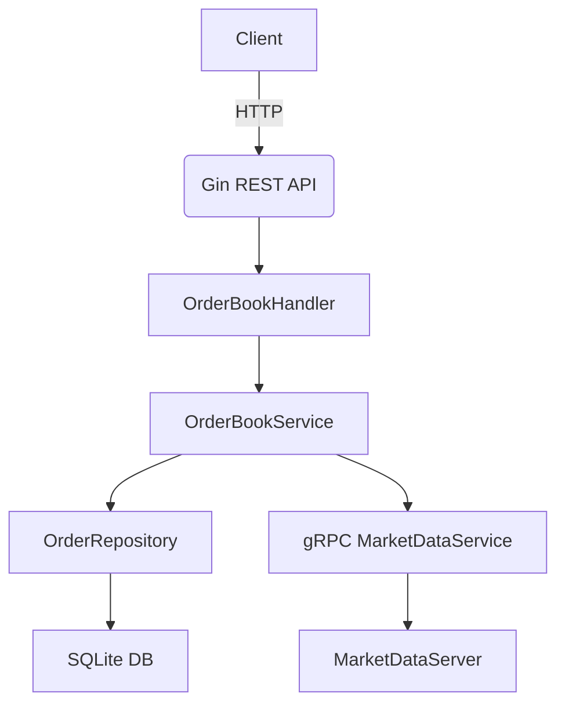

# Liquidity Provider

本專案是一個以 Go 語言實作的流動性提供者（Liquidity Provider）系統，具備訂單簿管理、撮合、網格策略下單、gRPC 市場數據服務等功能。適合用於數位資產自動化交易、撮合引擎或交易策略開發。

## 主要功能

- **訂單簿管理**：支援下單、查詢、撮合、狀態更新等功能。
- **網格交易策略**：可自動根據市價與設定的 grid size/levels 進行網格下單。
- **gRPC 市場數據服務**：模擬市場價格與成交量，供策略與撮合邏輯即時查詢。
- **RESTful API**：透過 Gin 提供下單與策略操作的 HTTP 介面。
- **SQLite 資料庫**：以 GORM 操作 SQLite 儲存訂單資料。

## 架構說明



## 目錄結構

- `cmd/main.go`：專案進入點，啟動 HTTP 與 gRPC 服務。
- `internal/handlers/`：API handler，處理 HTTP 請求。
- `internal/services/`：商業邏輯層，包含訂單簿、撮合、策略等。
- `internal/market/`：gRPC 市場數據服務。
- `internal/models/`：資料模型（如 Order）。
- `internal/repositories/`：資料存取層。
- `orders.db`：SQLite 資料庫檔案。

## 安裝與執行

1. 安裝 Go 1.18+ 與 SQLite
2. 安裝依賴套件
   ```bash
   go mod tidy
   ```
3. 啟動服務
   ```bash
   go run cmd/main.go
   ```
   - HTTP API 監聽於 `:8080`
   - gRPC 服務監聽於 `:50051`

## API 範例

### 下單

```
POST /orders
{
  "symbol": "BTCUSD",
  "side": "buy",
  "price": 50000,
  "quantity": 0.1
}
```

### 套用網格策略

```
POST /grid
{
  "symbol": "BTCUSD",
  "gridSize": 100,
  "levels": 5
}
```

## 資料結構

### Order

| 欄位     | 型態    | 說明         |
|----------|---------|--------------|
| Symbol   | string  | 交易對       |
| Price    | float64 | 價格         |
| Quantity | float64 | 數量         |
| Side     | string  | "buy"/"sell" |
| Status   | string  | "open"/"closed"/"canceled" |

## 測試

```bash
go test ./internal/services/
go test ./internal/market/
```
